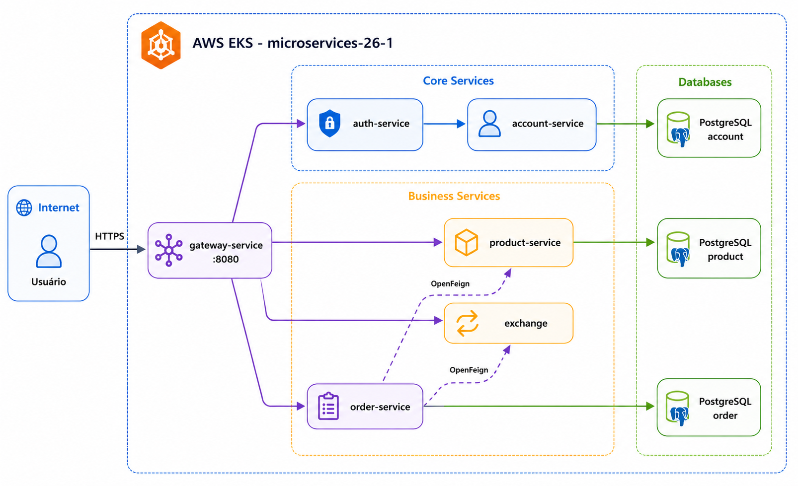

# 🛒 Microservices — Store Platform

> **Plataformas, Microserviços, DevOps e APIs — 2026.1**  
> Insper · Projeto Final

[](https://TODO.github.io/microservices)
[](LICENSE)

---

## 👥 Grupo — microservices-26-1

| Integrante | Microserviço |
|---|---|
| Ana Beatriz da Cunha | Order API |
| Gustavo Santana | Product API & Exchange API |

---

## 📐 Arquitetura



---

## 📦 Repositórios

| Repositório | Linguagem | Descrição |
|---|---|---|
| **[microservices](https://github.com/microservices-26-1/microservices)** | TypeScript | Repositório principal — Docker Compose, infra, submodules |
| **[gateway-service](https://github.com/microservices-26-1/gateway-service)** | Java | API Gateway (Spring Cloud Gateway) |
| **[auth-service](https://github.com/microservices-26-1/auth-service)** | Java | Autenticação e JWT |
| **[account-service](https://github.com/microservices-26-1/account-service)** | Java | Gerenciamento de contas |
| **[product](https://github.com/microservices-26-1/product)** | Java | Interfaces e contratos do Product |
| **[product-service](https://github.com/microservices-26-1/product-service)** | Java | Implementação do Product |
| **[order](https://github.com/microservices-26-1/order)** | Java | Interfaces e contratos do Order |
| **[order-service](https://github.com/microservices-26-1/order-service)** | Java | Implementação do Order |
| **[exchange](https://github.com/microservices-26-1/exchange)** | Python | Taxas de câmbio |
| **[postgres](https://github.com/microservices-26-1/postgres)** | — | Scripts e configurações do banco |

---

## 🚀 Como Rodar Localmente

### Pré-requisitos

- Docker Desktop
- Docker Compose v2+
- Java 21 (para desenvolvimento)

### 1. Clonar o repositório com submodules

```bash
git clone --recurse-submodules https://github.com/microservices-26-1/microservices.git
cd microservices
```

Se já clonou sem os submodules:

```bash
git submodule update --init --recursive
```

### 2. Configurar variáveis de ambiente

```bash
cp .env.example .env
# edite o .env conforme necessário
```

### 3. Subir os serviços

```bash
docker compose up -d
```

### 4. Verificar os serviços

```bash
docker compose ps
```

| Serviço | URL Local |
|---|---|
| Gateway | http://localhost:8080 |
| Grafana | http://localhost:3000 |
| Prometheus | http://localhost:9090 |

---

## 🏗️ Estrutura do Repositório

```
📁 microservices/
├── 📁 api/
│   ├── 📁 account/            # submodule → account
│   ├── 📁 account-service/    # submodule → account-service
│   ├── 📁 auth/               # submodule → auth
│   ├── 📁 auth-service/       # submodule → auth-service
│   ├── 📁 exchange/           # submodule → exchange
│   ├── 📁 gateway-service/    # submodule → gateway-service
│   ├── 📁 nginx/              # Load Balancer config
│   ├── 📁 order/              # submodule → order
│   ├── 📁 order-service/      # submodule → order-service
│   ├── 📁 postgres/           # submodule → postgres
│   ├── 📁 product/            # submodule → product
│   ├── 📁 product-service/    # submodule → product-service
│   ├── 📁 setup/              # scripts de configuração inicial
│   └── 📁 volume/
│       ├── 📁 grafana/        # datasources, dashboards
│       └── 📁 prometheus/     # prometheus.yml
├── 📁 docs/                   # documentação MkDocs
├── 📁 jenkins/                # pipelines Jenkins
├── 📁 site/                   # site gerado pelo MkDocs
├── 📁 web/                    # frontend
├── 📄 .env
├── 📄 .gitignore
├── 📄 .gitmodules
├── 📄 compose.yaml
├── 📄 mkdocs.yml
├── 📄 README.md
└── 📄 requirements.txt
```

---

## ☁️ Deploy na AWS (EKS)

O projeto é implantado em um cluster **Amazon EKS** com:

- **VPC** com subnets públicas e privadas (2 AZs)
- **Node Group** com instâncias EC2 (`t3.medium`)
- **HPA** para escalonamento automático
- **Jenkins** para CI/CD

📖 Documentação completa: [docs/project/eks.md](docs/project/eks.md)

---

## 📊 Observabilidade

O stack de observabilidade inclui **Prometheus + Grafana** para monitoramento das métricas JVM e HTTP:

- Dashboard Spring Boot APM (Grafana ID: 12900)
- Métricas: CPU, memória JVM, latência HTTP, taxa de erros

---

## 💰 Custos AWS

Custo acumulado até maio/2026: **$21.73**

Principais serviços: EKS Control Plane, EC2 (worker nodes), VPC (NAT Gateway).

📖 Análise completa: [docs/project/costs.md](docs/project/costs.md)

---

## 📚 Documentação

A documentação completa está disponível em: **[TODO.github.io/microservices](https://TODO.github.io/microservices)**

Gerada com [MkDocs Material](https://squidfunk.github.io/mkdocs-material/).

---

## 📄 Licença

MIT © microservices-26-1
