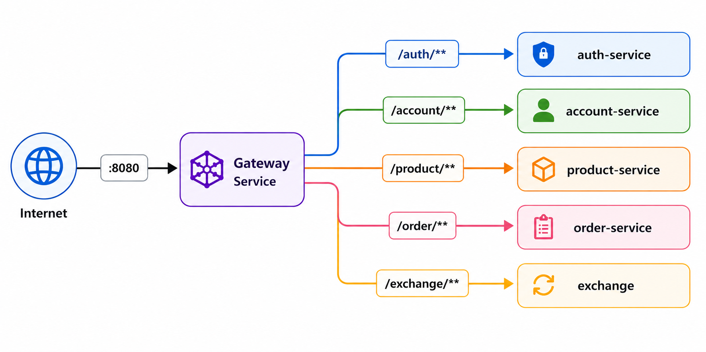
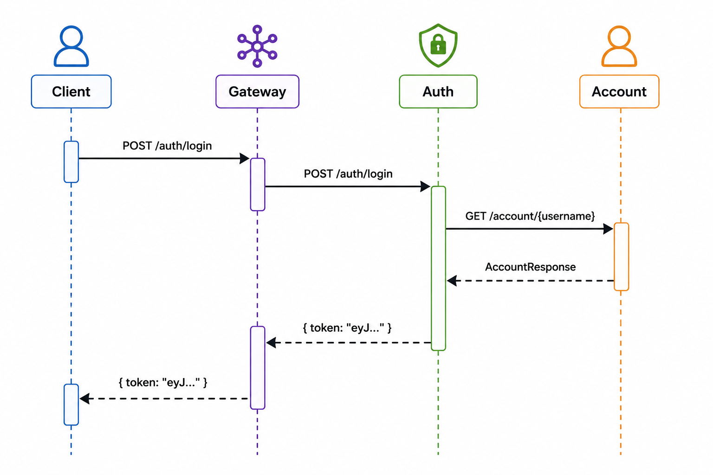

# Arquitetura

## Visão geral

A aplicação segue uma arquitetura baseada em microsserviços, com o **Gateway Service** como porta de entrada única e os serviços de negócio isolados por domínio.

## Componentes principais

### Gateway Service
Responsável por:
- receber as requisições externas
- validar JWT nas rotas protegidas
- encaminhar para o serviço correto
- expor métricas para observabilidade

### Auth Service
Responsável por:
- login
- geração de JWT
- validação de token para o gateway
- integração com Account Service

### Account Service
Responsável por:
- cadastro de usuário
- consulta por ID e username
- atualização de dados

### Product Service
Responsável pelo catálogo de produtos.

### Order Service
Responsável pelo fluxo de pedidos e pela integração com Product Service e Exchange.

### Exchange
Responsável pela conversão de valores entre moedas.

## Fluxo de autenticação

1. O cliente chama `/auth/login` pelo gateway.
2. O gateway encaminha para o Auth Service.
3. O Auth Service consulta o Account Service.
4. Se os dados estiverem corretos, um JWT é retornado.

## Infraestrutura em AWS

A implantação utiliza AWS EKS com separação entre serviços centrais, serviços de negócio e bancos PostgreSQL por domínio.