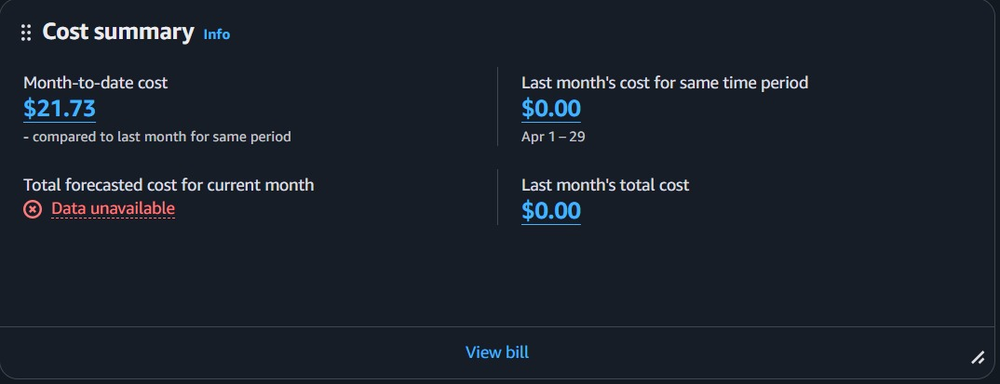
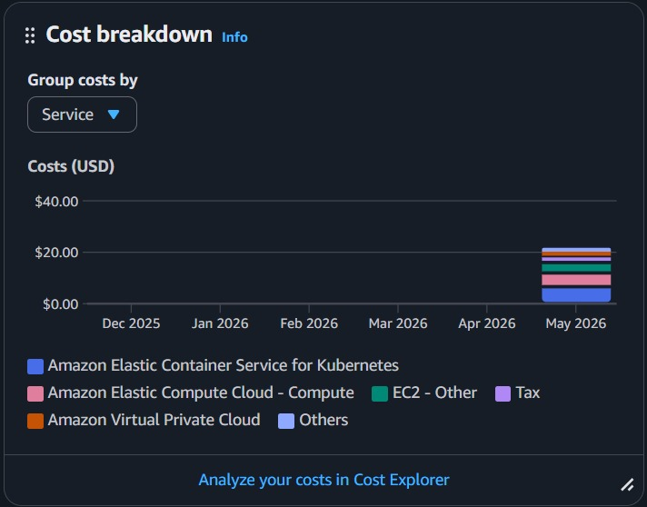

# Custos AWS

## Resumo

O custo acumulado observado no período foi de **USD 21.73**.

## Breakdown

## Serviços citados

- Amazon EKS
- Amazon EC2
- Amazon VPC

A maior parte do custo está associada aos recursos computacionais do cluster e à infraestrutura de rede.
