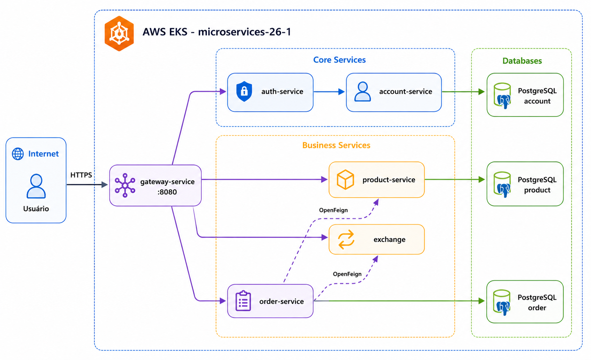

# Execução

## Executando localmente

### Pré-requisitos
- Java 21
- Maven
- Docker
- Docker Compose
- Git

### Clonando o repositório

```bash
git clone --recurse-submodules https://github.com/microservices-26-1/microservices.git
cd microservices
```

### Subindo o ambiente

```bash
cp .env.example .env
docker compose up -d
docker compose ps
```

## Serviços expostos

| Serviço | URL local |
|---|---|
| Gateway | `http://localhost:8080` |
| Grafana | `http://localhost:3000` |
| Prometheus | `http://localhost:9090` |

## Execução dos serviços

Cada serviço pode ser executado individualmente durante desenvolvimento, mas a forma recomendada para apresentação é usar o `compose.yaml`.

## CI/CD

O projeto usa Jenkins para build, testes, containerização e deploy.

## AWS EKS



A imagem acima resume o deploy em AWS EKS com gateway, serviços de negócio e bases PostgreSQL separadas por domínio.
