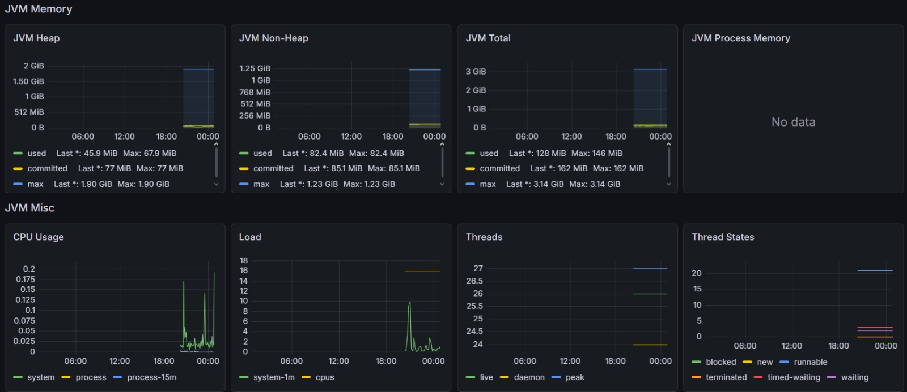
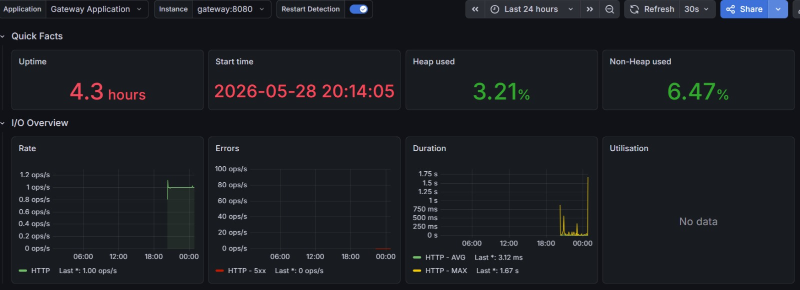

# Monitoramento

## Stack de observabilidade

O projeto usa:
- Spring Boot Actuator
- Micrometer
- Prometheus
- Grafana

## JVM

Métricas observadas:
- Heap
- Non-Heap
- CPU Usage
- Threads
- Thread States

## Aplicação

Métricas observadas:
- uptime
- request rate
- errors
- duration

## Leitura dos resultados

A aplicação se manteve estável, com baixo consumo de memória e CPU e taxa de erro próxima de zero.
