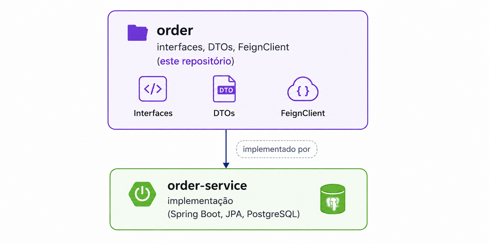

# Serviços

## Gateway Service
Ponto único de entrada da aplicação.

Funções:
- roteamento
- validação JWT
- observabilidade

## Auth Service
Responsável pela autenticação e emissão de JWT.

Baseado no README do serviço, ele faz login e valida token, integrando com Account Service.

## Account Service
Gerencia contas de usuário, com criação, consulta e atualização.

## Product Service
Gerencia o catálogo de produtos. O contrato expõe listagem, busca, criação, atualização e remoção, com perfis de acesso separados para usuários e admin.

## Order Service
Responsável pelos pedidos e pela integração com Product e Exchange. A separação entre contratos e implementação está documentada nos repositórios `order` e `order-service`.

## Exchange
Fornece taxas de câmbio entre moedas e lista moedas suportadas.

## Relação entre contrato e implementação

